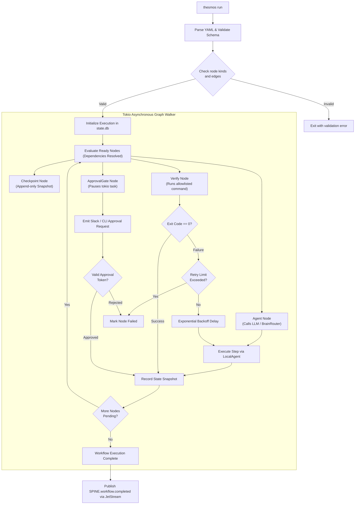

# thesmos — Deep Operational & Architectural Context for Agents

> **Deterministic Workflow DAG Engine & State Machine** — In-depth architectural guide, execution lifecycle, node taxonomy, complete CLI matrix, MCP tool contracts, and failure recovery runbooks for `thesmos`.  
> **Ecosystem Version Baseline:** `v1.0.0-rc3`  
> **Documentation Hub:** [https://autonomic-ai.dev/docs/workflows](https://autonomic-ai.dev/docs/workflows) · [Architecture Hub](https://autonomic-ai.dev/docs/architecture)  
> **Ports:** dashboard API `:3000` · dashboard `:3001` · event bus `:3100`  
> **Default Workspace & State:** `~/.autonomic/state/spine` (workflows) · `~/.autonomic/logs/spine/state.db` (run state)

---

## 1. Executive Summary & Biological Role

**`thesmos`** is the **Deterministic Workflow Engine** (analogous to Kubernetes Jobs, Argo Workflows, or Temporal). 

Most AI coding agents fail because they rely on unconstrained, probabilistic prompt loops:
- The agent is asked *"fix bug X"*, and it improvises an unpredictable series of file reads, edits, and terminal commands.
- If step 4 fails, the agent often enters an hallucinatory retry loop, burns hundreds of dollars in tokens, or destroys working code.
- There is no audit trail, no deterministic replay, no coordinated parallelism, and no verifiable human approval gate.

`thesmos` replaces ad-hoc prompt improvisation with **version-controlled, declarative graphs of named nodes and edges** written in YAML. Workflows may contain cycles:
- The graph dictates the control flow, concurrency, checkpoints, and gates.
- The LLM acts strictly as a bounded worker executing isolated tasks *within* designated nodes.
- Every state change is appended as a snapshot in SQLite, so a finished run can be inspected and replayed with `thesmos replay`.

---

## 2. Core Architecture & Node Taxonomy


```mermaid
flowchart TD
    RunCmd["thesmos run <workflow.yaml>"] --> Parse["Parse YAML & Validate Schema"]
    Parse --> Validated{"Check node kinds<br>and edges"}
    Validated -->|Invalid| ErrExit["Exit with validation error"]
    Validated -->|Valid| InitState["Initialize Execution in state.db"]

    subgraph DAGExecution ["Tokio Asynchronous Graph Walker"]
        InitState --> Walk["Evaluate Ready Nodes (Dependencies Resolved)"]
        
        Walk --> AgentNode["Agent Node<br>(Calls LLM / BrainRouter)"]
        Walk --> CheckpointNode["Checkpoint Node<br>(Append-only Snapshot)"]
        Walk --> VerifyNode["Verify Node<br>(Runs allowlisted command)"]
        Walk --> GateNode["ApprovalGate Node<br>(Pauses tokio task)"]
        
        AgentNode --> ExecNode["Execute Step via LocalAgent"]
        ExecNode --> SaveSnap["Record State Snapshot"]
        
        VerifyNode --> CheckExit{"Exit Code == 0?"}
        CheckExit -->|Success| SaveSnap
        CheckExit -->|Failure| RetryPolicy{"Retry Limit<br>Exceeded?"}
        RetryPolicy -->|No| Backoff["Exponential Backoff Delay"] --> ExecNode
        RetryPolicy -->|Yes| FailStep["Mark Node Failed"]
        
        GateNode --> EmitAlert["Emit Slack / CLI Approval Request"]
        EmitAlert --> WaitToken{"Valid Approval<br>Token?"}
        WaitToken -->|Approved| SaveSnap
        WaitToken -->|Rejected| FailStep
        
        SaveSnap --> CheckComplete{"More Nodes<br>Pending?"}
        CheckComplete -->|Yes| Walk
        CheckComplete -->|No| FinishWork["Workflow Execution Complete"]
    end

    FinishWork --> CompletionNotify["Publish SPINE.workflow.completed via JetStream"]
```

### 2.1 Node Kinds (`NodeKind`)

The released enum in `src/workflow.rs` defines eleven kinds. The first four are described below, then the rest.

1. **`Agent`**: Represents an isolated cognitive subtask. The step defines input variables, expected output keys, and optional prompt instructions. The executor hydrates required context via `BrainRouter` (querying `tekmor`), runs the subtask, and collects outputs.
2. **`Checkpoint`**: An explicit synchronization barrier that captures an immutable state snapshot (`Snapshot`) of the workflow state at that point.
3. **`Verify`**: Executes an allowlisted validation command (e.g. `cargo check`, `npm test`, `pytest`). Must return exit code 0 to transition to subsequent nodes.
4. **`ApprovalGate`**: A Human-in-the-Loop (HITL) safety barrier. When the execution reaches this node, the `tokio` worker suspends execution, enters the `PendingApproval` state, and emits events on the NATS bus when one is configured. A gate auto-approves unless auto-approval is turned off. When it is off, the node waits until its payload carries `approved: true`. No CLI command sets that flag.
5. **`Fork` / `Join`**: `Fork` runs one branch per outgoing edge in parallel. `Join` waits for all branches of the matching `Fork` before the workflow continues.
6. **`Router`**: Sets the variables that conditional edges use.
7. **`Debate`**: A coder and a critic alternate for a set number of rounds, or until the critic approves.
8. **`Vote`**: Runs the same prompt several times and selects the best output, by majority or by the lowest validation error.
9. **`Hydrate`**: Collects static context, such as the git diff, test output or file contents, into the payload before an agent runs.
10. **`SpeculativeFork`**: Planned. The released executor passes its payload through unchanged. It does not create worktrees or select a winner.

---

## 3. Concurrency, Retries & Snapshot Invariants

### 3.1 Fan-Out / Fan-In Parallelism
`thesmos` supports declarative parallel execution:
- Nodes with multiple outgoing edges fan out concurrently using `tokio::task::JoinSet`.
- Downstream *Join* nodes automatically pause until all incoming prerequisite edges resolve successfully.

### 3.2 Bounded Exponential Retries
Each node can set a retry policy with two fields, `max_attempts` and `backoff_ms`:
```yaml
retry_policy:
  max_attempts: 3
  backoff_ms: 1000
```
Retries use exponential backoff from the base `backoff_ms`. When the attempts run out, the node fails.

### 3.3 Immutable State Snapshots (Time-Travel Debugging)
Every successful node transition creates an append-only entry in `state.db`. If an agent makes a mistake on step 6:
- The developer can inspect the run with `thesmos inspect <EXECUTION_ID>` and recreate its final state with `thesmos replay <EXECUTION_ID>`.
- Snapshots are appended in order; the snapshot table is not updated in place.

---

## 4. Complete CLI Command Reference & Flags

`thesmos` provides a unified binary for CLI execution, schema validation, template scaffolding, and daemon service:

### 4.1 Workflow Execution & Lifecycle
- `thesmos run <WORKFLOW.yaml>`: Execute a workflow definition synchronously.
  - `-p, --payload <JSON>`: Initial JSON payload.
  - `-m, --meta <TEXT>`: Use tekmor to select the workflow from this task prompt before execution.
  - `-b, --brain`: Enable tekmor routing and enrichment.
  - `-d, --db <PATH>`: SQLite state database (default: `~/.autonomic/logs/spine/state.db`).
- `thesmos validate <WORKFLOW.yaml>`: Validate workflow syntax and node types. Workflows with cycles are accepted.
- `thesmos inspect <EXECUTION_ID>`: Show the history of one execution.
- `thesmos replay <EXECUTION_ID>`: Recreate an execution's final state.
- `thesmos status`: Show the capabilities planned for the current scaffold.

### 4.2 Human-in-the-Loop Approval Gates
There are no `approve` or `reject` commands. Gates auto-approve unless auto-approval is turned off; see the `ApprovalGate` node description above for the `approved: true` payload rule.

### 4.3 Template Scaffolding & Registry
- `thesmos init`: Scaffold an example workflow and check the environment.
  - `-f, --force`: Skip prerequisite checks (protoc, bun, tekmor).
  - `-d, --dir <DIR>`: Target directory (default: `~/.autonomic/state/spine`).
  - `-w, --with <WORKFLOW>`: Scaffold a built-in workflow instead of the generic example. `--with list` shows the built-in workflows (for example `engineering-safety`, `feature-from-spec`, `system-architect`) and the tekmor registry workflows (for example `@bugfix`, `@feature`).

### 4.4 Daemon & Server Modes
- `thesmos serve`: Start the live dashboard API.
  - `-p, --port <PORT>`: API port (default: `3000`).
  - `--dashboard-port <PORT>`: Dashboard port (default: `3001`).
  - `--nats-url <URL>`: Optional NATS JetStream URL for event publishing.
- `thesmos event serve`: Start the event bus server (default port `3100`).
- `thesmos mcp-serve`: Start standalone stdio MCP server exposing workflow orchestration tools directly to an IDE or any MCP host.

### 4.5 Diagnostics & Brain Integration
- `thesmos doctor`: Check rustc, protoc, bun, the `tekmor` binary, the spine state directory and the example workflow.
- `thesmos brain health`: Check whether tekmor is reachable.
- `thesmos brain route <TASK>`: Send a `route_task` query to tekmor and show the response.
- `thesmos brain status`: Show tekmor index and status information.

---

## 5. Model Context Protocol (MCP) Tool Specifications

When running in MCP mode (`thesmos mcp-serve`), the following tools are exposed:

### 5.1 `spine_submit_workflow`
- **Description:** Submits a YAML workflow for execution and returns its workflow ID.
- **Parameters:**
  - `yaml` (string, required): Inline YAML content of the workflow definition.
  - `name` (string, optional): Name for the workflow run.
- **Return:** The workflow ID, as text.

### 5.2 `spine_check_status`
- **Description:** Checks the status of a workflow execution by ID.
- **Parameters:**
  - `workflow_id` (string, required): The target execution ID.
- **Return:** The execution's current status, as text.

### 5.3 `spine_list_workflows`
- **Description:** Lists recent workflow executions with their IDs, names, statuses and timestamps.
- **Parameters:**
  - `limit` (integer, optional): Maximum number of executions to return.

---

## 6. Declarative Workflow YAML Specification

Below is an authentic, production-grade example of a workflow definition (`bugfix-pipeline.yaml`):

```yaml
name: bugfix_pipeline
version: 1
description: "Reproduce, isolate, fix, and verify a bug with human sign-off"
start_node: reproduce_failure

nodes:
  - name: reproduce_failure
    kind: verify
    command: "cargo test --test reproduce_bug"
    description: "Run the reproduction test"

  - name: isolate_and_patch
    kind: agent
    description: "Analyze the test failure, isolate the root cause, and apply a minimal patch"
    retry_policy:
      max_attempts: 2
      backoff_ms: 1000

  - name: verify_fix
    kind: verify
    command: "cargo test --all-features"
    description: "Confirm all tests pass after the patch"

  - name: human_review
    kind: approval_gate
    description: "Review the diff and the verification output before committing"

  - name: commit_and_log
    kind: agent
    description: "Commit with a conventional commit message and record the verification outcome"

edges:
  - from: reproduce_failure
    to: isolate_and_patch
  - from: isolate_and_patch
    to: verify_fix
  - from: verify_fix
    to: human_review
  - from: human_review
    to: commit_and_log
```

---

## 7. Cluster Operations & Troubleshooting Runbook

### 7.1 Problem: Workflow Blocked at `ApprovalGate`
- **Symptom:** Workflow status shows `paused_approval` and CLI hangs or agent waits.
- **Resolution:**
  ```bash
  # Inspect the execution to see which gate is waiting
  thesmos inspect <EXECUTION_ID>
  # Gates auto-approve unless auto-approval is turned off. There is no CLI command to approve a gate.
  ```

### 7.2 Problem: Re-run After a Failed Node
- **Symptom:** Workflow aborted at step 3 due to syntax error in generated code.
- **Resolution:**
  ```bash
  # 1. Inspect the failed execution
  thesmos inspect <EXECUTION_ID>
  # 2. Fix the file manually or adjust prompt
  # 3. Run the workflow again. There is no resume command.
  thesmos run bugfix.yaml
  ```

### 7.3 Problem: NATS JetStream Disconnected During Workflow
- **Symptom:** Events fail to publish to `SPINE.workflow.>` topics.
- **Resolution:**
  ```bash
  # Verify NATS broker is running
  curl -s http://127.0.0.1:8222/healthz
  # Restart the NATS server with your installation's service manager
  ```
