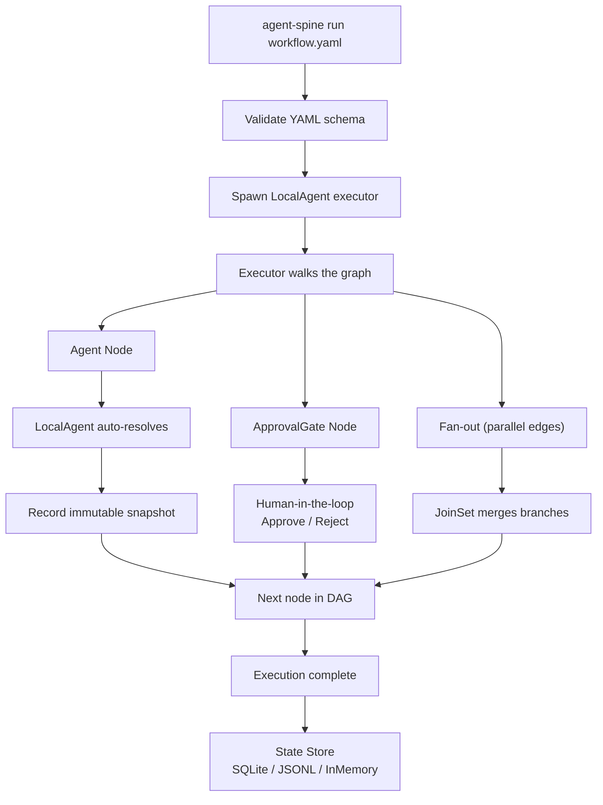

# agent-spine — Deterministic Workflow Engine for AI Agents

**YAML-defined DAG pipelines, immutable state snapshots, parallel execution, and a gRPC event bus for multi-organ coordination.**

agent-spine is the **central nervous system** of the Autonomic AI ecosystem. It defines **what happens when** — a deterministic DAG of nodes (agent, approval, checkpoint, verify) that executes in order, records every state transition as an immutable snapshot, and supports fan-out/fan-in parallelism with human-in-the-loop approval gates.

Unlike shell scripts, CI pipelines, or Makefiles, agent-spine is purpose-built for **agent-driven workflows**: it supports retry policies with exponential backoff, confidence-based escalation, optional MCP bridging to agent-brain for per-node context routing, and a pluggable state store (InMemory, JSONL, SQLite).

---

## Core Concept

Most AI coding workflows are improvised ad-hoc: "run lint, then tests, then build, then review." But improvisation means no audit trail, no parallelism, no retry discipline, and no way to reproduce what happened.

agent-spine treats workflows as **first-class artifacts** — versioned YAML definitions with explicit node types, edges, and policies. Every execution produces an **append-only, immutable chain of snapshots** linked by parent references. You can replay any execution to see exactly what happened and compare branches.

The key bet: **deterministic execution beats probabilistic prompting for control flow.** agent-spine follows the DAG, not the model's mood.



---

## Standalone vs Integrated

| Mode | What you type | What happens |
|------|--------------|--------------|
| **Standalone** | `agent-spine run dev-pipeline.yaml` | Execute a workflow YAML with embedded LocalAgent |
| **Standalone** | `agent-spine serve` | Start gRPC event bus + dashboard API on `:3100` |
| **Standalone** | `agent-spine validate workflow.yaml` | Schema validation without execution |
| **Integrated** | agent-spine `:3100` | Peripheral organs register as event subscribers |
| **Integrated** | BrainRouter | MCP bridge to agent-brain for context per node |
| **Integrated** | agent-heart budget gate | Spine checks `/budget/check` before LLM-heavy nodes |

In standalone mode, agent-spine is a local workflow runner. In integrated mode, it becomes the **event backbone** — organs register, publish domain events (`*.executed`, `*.indexed`, `*.failed`), and agent-spine orchestrates multi-organ pipelines.

---

## Why agent-spine?

| Problem | agent-spine answer |
|---------|-------------------|
| "We run lint, test, build manually every time" | **Declarative YAML** — one file defines the entire pipeline. `agent-spine run` executes it. |
| "A test failed; did it pass before my change?" | **Immutable snapshots** — every transition recorded with parent linkage. Replay any execution. |
| "I need a human to review before deploy" | **ApprovalGate** — workflow pauses, waits for resume, rejects with error if denied. |
| "Parallel branches are impossible to coordinate" | **Fan-out/fan-in** — multiple edges execute concurrently; JoinSet merges before proceeding. |
| "My agent retried forever and burned $500 in tokens" | **Exponential backoff + hard limits** — configurable retry policy prevents unbounded loops. |
| "I can't tell what happened in the last run" | **InMemory · JSONL · SQLite** — state stores record every snapshot for inspection and replay. |
| "I need the right context per workflow node" | **BrainRouter** — optional MCP bridge to agent-brain for task routing and trajectory logging. |

---

## What makes this different

| Approach | Strengths | What it misses | agent-spine does it |
|----------|-----------|----------------|---------------------|
| **Shell scripts** | Simple, universal | No DAG, no state, no parallelism, no gates | YAML-defined graph with branching, joins, and HITL |
| **GitHub Actions / CI** | Push-triggered, hosted | Not for local agent-driven workflows | `agent-spine run` — local-first, agent-triggered |
| **LangGraph / CrewAI** | Multi-agent Python runtime | Local binary, no IDE hooks, framework lock-in | Single Rust binary — no Python/JS runtime needed |
| **Makefiles / Justfiles** | Fast task runner | No state machine, no approval gates, no replay | Append-only snapshots + retries + replay |
| **Manual prompting** | "Please run tests, then build" | No enforcement, no audit, no parallelism | Declarative graph + immutable history |

---

## What you get

| Feature | Why use it |
|---------|------------|
| **YAML workflow definitions** | Versioned schema with validation; `NodeKind` types: Agent, Checkpoint, Verify, ApprovalGate |
| **Immutable snapshots** | Parent-linked, monotonic sequence — every transition is auditable |
| **Parallel fan-out/fan-in** | JoinSet-based concurrent branches merged at join nodes |
| **ApprovalGate** | Human-in-the-loop pause/resume; reject blocks execution with error |
| **Exponential backoff retries** | Prevents unbounded agent retries on failure (configurable: initial delay, max attempts) |
| **ConfidenceRouter** | Escalates after N consecutive failures (threshold-based routing) |
| **State stores** | InMemory (dev), JSONL (file), SQLite (persistent) |
| **BrainRouter** | Optional MCP bridge to agent-brain for per-node context routing |
| **LocalAgent** | Auto-resolves Agent/Checkpoint/ApprovalGate nodes — no external hooks |
| **CLI** | `run/validate/init/serve` — single binary, no runtime dependencies |

---

## Commands

| Command | Description |
|---------|-------------|
| `agent-spine init` | Generate config, check prerequisites, create example `dev-pipeline.yaml` (10 nodes) |
| `agent-spine run <file>` | Execute a workflow YAML with built-in LocalAgent |
| `agent-spine validate <file>` | Validate a workflow definition against the schema |
| `agent-spine serve` | Start gRPC + dashboard API server on port 3100 |
| `agent-spine brain health` | Check agent-brain MCP connectivity |
| `agent-spine brain route <task>` | Route a task through agent-brain for context |

---

## Quick Install

```bash
curl -fsSL https://raw.githubusercontent.com/autonomic-ai-dev/agent-spine/master/scripts/install.sh | bash
agent-spine init
agent-spine run dev-pipeline.yaml
```

Or from source:
```bash
git clone https://github.com/autonomic-ai-dev/agent-spine.git && cd agent-spine
cargo build --release
./target/release/agent-spine init
./target/release/agent-spine run dev-pipeline.yaml
```

---

## Programmatic Usage

```rust
use std::sync::{Arc, Mutex};
use agent_spine::{
    Executor, Supervisor,
    workflow::{WorkflowDefinition, WorkflowNode, WorkflowEdge, NodeKind},
    state::InMemoryStateStore,
};

let workflow = WorkflowDefinition::new("my_pipeline", 1, "start", nodes, edges)
    .validate()?;
let store = Arc::new(Mutex::new(InMemoryStateStore::default()));
let supervisor = Supervisor::new();
let mut executor = Executor::new(validated, store, supervisor);
let exec_id = executor.run(serde_json::json!({ "input": "data" })).await?;
```

---

## Design Principles

1. **Immutable history** — state snapshots are append-only; every transition references its parent
2. **Versioned schemas** — workflow and state schemas are explicitly versioned to prevent drift
3. **Bounded retries** — agents have hard execution limits; no unbounded loops
4. **Idempotent effects** — external effects use idempotency keys recorded before acknowledgment
5. **Human-in-the-loop** — ApprovalGate pauses execution for mandatory human review at configurable transitions
6. **Adapter pattern** — provider-specific behavior (brain routing, state storage) behind trait boundaries
7. **Branching replay** — replay creates a new execution branch; it never rewrites history

---

## Dashboard

```bash
# Terminal 1 — start spine server
agent-spine serve --db state.db --port 3000

# Terminal 2 — start dashboard (requires bun)
cd dashboard && bun install && bun run dev
```

---

## Development

```bash
cargo fmt --all -- --check
cargo clippy --workspace --all-targets --all-features -- -D warnings
cargo test --workspace --all-features
```

Prerequisites (source build): `protoc` (gRPC codegen), `bun` (dashboard — optional), `agent-brain` (MCP bridge — optional).

---

## License

Apache License 2.0
