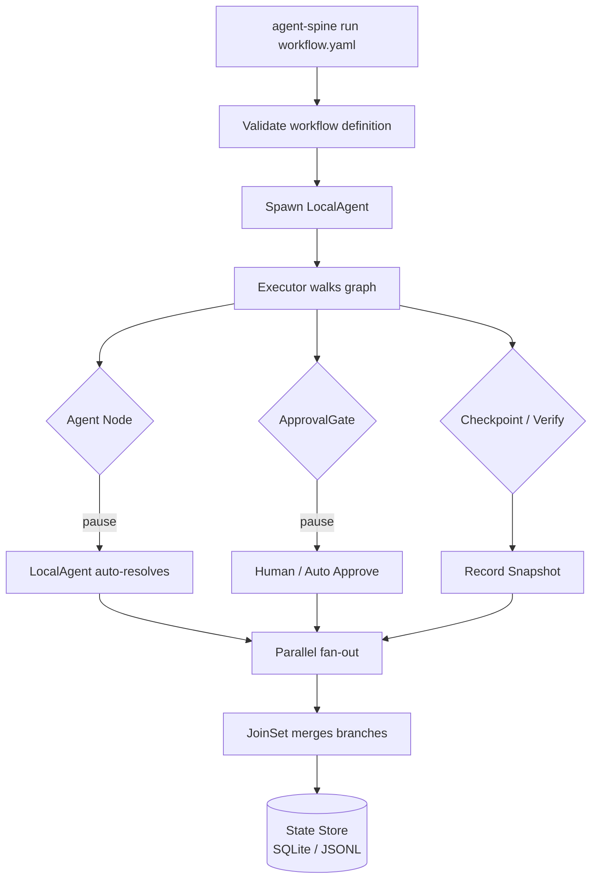

# agent-spine

**Deterministic workflow engine for AI agents — YAML pipelines, state snapshots, and an HTTP event bus.**

Part of the **[Autonomic AI](https://github.com/autonomic-ai-dev/agent-body)** ecosystem. Runs standalone or as the orchestration hub that peripheral organs register with on port **3100**.

| Standalone | Integrated |
|------------|------------|
| `agent-spine run workflow.yaml` | Budget gate via agent-heart |
| `agent-spine serve` (event bus) | Organs publish `*.executed`, `*.indexed`, … |
| Local state stores | `[spine]` in `~/.autonomic/config.toml` |

```bash
curl -fsSL https://raw.githubusercontent.com/autonomic-ai-dev/agent-spine/master/scripts/install.sh | bash
agent-spine init
agent-spine run dev-pipeline.yaml
```

---

## Why agent-spine?

Every non-trivial AI coding task needs structure — but most teams improvise it ad-hoc:

| Problem | agent-spine answer |
|---------|-------------------|
| "We run lint, test, build manually every time" | **Declarative YAML** — one file defines plan → lint → test+security → build → review → deploy. `agent-spine run` executes it. |
| "A test failed; did it pass before my change?" | **Immutable append-only snapshots** — every transition recorded with parent linkage. Replay any execution to compare. |
| "I need a human to review before deploy" | **ApprovalGate nodes** — workflow pauses at the gate, waits for resume, rejects with error if denied. |
| "Parallel branches are hard to coordinate" | **Fan-out/fan-in** — multiple outgoing edges execute concurrently; `JoinSet` merges results before proceeding. |
| "My agent retried forever and burned tokens" | **Exponential backoff + hard limits** — configurable retry policy prevents unbounded loops. |
| "I can't tell what happened in the last run" | **InMemory · JSONL · SQLite** — state stores record every snapshot for inspection and  replay. |
| "I need agent-brain context per node" | **Optional BrainRouter** — MCP bridge to agent-brain for task routing, payload enrichment, and trajectory logging. |

---

## How this is different

| Approach | What it does | What it misses | agent-spine |
|----------|-------------|----------------|-------------|
| **Shell scripts** | Sequential commands | No DAG, no state, no parallelism, no gates | YAML-defined graph with branching, join, and HITL |
| **GitHub Actions / CI** | Push/tag triggered pipelines | Not for local agent-driven workflows | `agent-spine run` — local-first, agent-triggered |
| **LangGraph / CrewAI** | Multi-agent runtime in *your app* | Local binary, IDE hooks, no framework lock-in | Single binary — no Python/JS runtime needed |
| **Makefiles / Justfiles** | Task runner with deps | No state machine, no approval gates, no replay | Append-only snapshots + retries + replay |
| **Manual agent prompting** | "Please run tests, then build" | No enforcement, no audit trail, no parallelism | Declarative graph + immutable history |

---

## What you get (main features)

| Feature | Why use it |
|---------|------------|
| **YAML workflow definitions** | Versioned schema, validation, `NodeKind` (Agent, Checkpoint, Verify, ApprovalGate) |
| **Immutable snapshots** | Parent-linked, monotonic sequence — every transition is auditable |
| **Parallel fan-out/fan-in** | `JoinSet`-based concurrent branches merged at join nodes |
| **ApprovalGate** | Human-in-the-loop pause/resume — reject blocks execution with error |
| **Exponential backoff retries** | Prevents unbounded agent retries on failure |
| **ConfidenceRouter** | Escalates after N consecutive failures (threshold-based) |
| **State stores** | InMemory (dev), JSONL (file), SQLite (persistent) |
| **BrainRouter (optional)** | MCP bridge to agent-brain for context routing, enrichment, trajectory |
| **LocalAgent** | Auto-resolves Agent/Checkpoint/ApprovalGate nodes — no external hooks needed |
| **CLI run/validate/init/serve** | Single binary, no Python/Node runtime |

---

## Commands

| Command | Description |
|---------|-------------|
| `agent-spine init` | Generate config, prerequisites check, example `dev-pipeline.yaml` (10 nodes) |
| `agent-spine run <file>` | Execute workflow YAML with built-in LocalAgent |
| `agent-spine validate <file>` | Validate workflow definition |
| `agent-spine serve` | Start gRPC + dashboard API server |
| `agent-spine brain health` | Check agent-brain connectivity |
| `agent-spine brain route <task>` | Route a task through agent-brain |
| `agent-spine brain status` | Show brain connection status |

---

## How a run works



---

## Quick Install

### Binary install

```bash
curl -fsSL https://raw.githubusercontent.com/autonomic-ai-dev/agent-spine/master/scripts/install.sh | bash
```

Auto-detects your OS/arch, downloads the correct binary from the latest release, and installs to `/usr/local/bin`. Supports **macOS** (x86_64, aarch64), **Linux** (x86_64, aarch64), and **Windows** (x86_64, via Git BASH/MSYS2).

Override the install directory or pin a specific version:

```bash
INSTALL_DIR=~/.local/bin AGENT_SPINE_VERSION=0.16.2 curl -fsSL https://raw.githubusercontent.com/autonomic-ai-dev/agent-spine/master/scripts/install.sh | bash
```

Or from source:

```bash
git clone https://github.com/autonomic-ai-dev/agent-spine.git && cd agent-spine
cargo build --release
./target/release/agent-spine init
./target/release/agent-spine run dev-pipeline.yaml
```

### Programmatic usage

```rust
use std::sync::{Arc, Mutex};
use agent_spine::{
    Executor, Supervisor,
    workflow::{WorkflowDefinition, WorkflowNode, WorkflowEdge, NodeKind},
    state::InMemoryStateStore,
};

let workflow = WorkflowDefinition::new("my_pipeline", 1, "start", nodes, edges)
    .validate()?;
let store = Arc::new(Mutex::new(InMemoryStateStore::default()));
let supervisor = Supervisor::new();

let mut executor = Executor::new(validated, store, supervisor);
let exec_id = executor.run(serde_json::json!({ "input": "data" })).await?;
```

### Dashboard

```bash
# Terminal 1 — start server
agent-spine serve --db state.db --port 3000

# Terminal 2 — start dashboard (requires bun)
cd dashboard && bun install && bun run dev
```

---

## Key design

1. State snapshots are **immutable and append-only**; every transition references its parent.
2. Workflow and state schemas are **explicitly versioned**.
3. Retries have **hard execution limits** — agents do not loop unbounded.
4. External effects use **idempotency keys** recorded before acknowledgement.
5. **Human approval** is required for configured high-impact transitions (ApprovalGate).
6. Provider-specific behavior remains behind **adapter traits**.
7. Replay creates a **new execution branch** — it does not rewrite history.

---

## Development

```bash
cargo fmt --all -- --check
cargo clippy --workspace --all-targets --all-features -- -D warnings
cargo test --workspace --all-features
```

### Prerequisites (source build only)

- **protoc** — gRPC codegen (<https://grpc.io/docs/protoc-installation/>)
- **bun** — dashboard dev (<https://bun.sh>) — optional
- **agent-brain** — MCP routing & memory (<https://github.com/autonomic-ai-dev/agent-brain>) — optional

---

## License

Licensed under the Apache License, Version 2.0. See [LICENSE](LICENSE).
