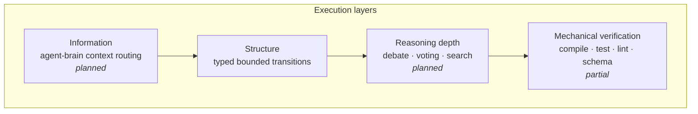
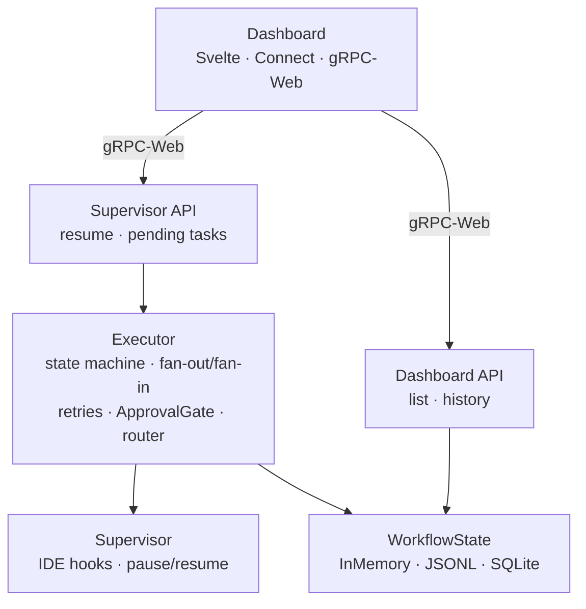
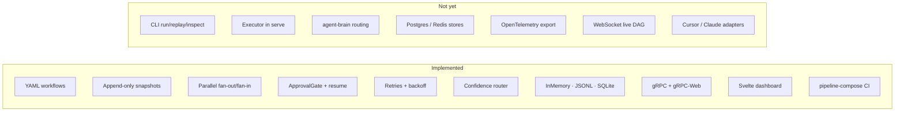
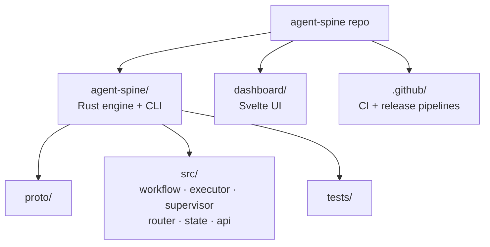

# Agent Spine

Agent Spine is a local-first, stateful workflow engine for supervising AI coding agents. It provides deterministic graph execution, immutable state history, and native IDE hooks while [`agent-brain`](https://github.com/aeswibon/agent-brain) is intended to supply token-efficient context for each node.

The project is **not** another terminal-bound agent crew. It targets a lightweight Rust supervisor that integrates with tools like Claude Code and Cursor, runs declarative YAML workflows, and records every state transition for inspection, replay, and intervention.

> **Status:** Phase 1–2 in progress. The execution engine, state stores, gRPC supervisor, confidence router, parallel fan-out/fan-in, and a Svelte dashboard are implemented. CLI `run`/`replay`/`inspect`, agent-brain routing, and production persistence adapters are not yet wired end-to-end.

Planning docs and the repository audit live in [`docs/superpowers/`](docs/superpowers/) (local only, not committed).

## Why Agent Spine?

Existing orchestration frameworks are capable, but local production workflows often hit the same operational costs:

- graph definitions accumulate infrastructure boilerplate;
- cyclic failures are difficult to diagnose because state changes are opaque;
- execution is separated from the IDE agent interface where developers already work;
- retries and multi-agent reasoning can become unbounded or impossible to audit.

Agent Spine treats these as execution-engine problems. Workflows should be declarative, transitions immutable, verification mechanical, and escalation explicit.

## Architecture

Agent Spine is organized around four layers:



### System overview



### Core modules

| Module | Role |
|--------|------|
| `workflow` | YAML workflow definitions, validation, `NodeKind` (`Agent`, `Checkpoint`, `Verify`, `ApprovalGate`) |
| `executor` | Async state-machine traversal with parallel branches, fan-in merge, retries, and routing |
| `supervisor` | Pauses agent nodes and waits for IDE `resume()` via gRPC |
| `router` | `ConfidenceRouter` — tracks verification failures and sets `escalation_required` |
| `state` | Append-only `WorkflowState` trait with in-memory, JSONL file, and SQLite adapters |
| `api` | gRPC services generated from `proto/supervisor.proto` |
| `dashboard/` | Svelte frontend for execution monitoring and HITL resume |

Rust is the primary implementation language for predictable resource use, safe concurrency, durable local execution, and a single distributable binary. Model providers, IDE integrations, and persistence backends remain behind adapter traits.

## Current capabilities



### Implemented

- **Declarative YAML workflows** with versioned schemas and validation
- **Immutable append-only snapshots** with parent linkage and monotonic sequence numbers
- **Parallel fan-out / fan-in** via multiple outgoing edges and `tokio::task::JoinSet`
- **Human-in-the-loop gates** via `ApprovalGate` nodes and supervisor resume
- **Built-in retries** with exponential backoff before supervisor failure (hardcoded policy today)
- **Confidence routing** after repeated verification failures
- **State stores**: `InMemoryStateStore`, `FileStateStore` (JSONL), `SqliteStateStore`
- **gRPC supervisor + dashboard API** with gRPC-Web and CORS for browser clients
- **Live dashboard** (Svelte) — execution list, history viewer, pending-task resume
- **CI/CD** via `pipeline-compose` — Rust check, multi-platform release builds, tag publish

### Not yet implemented

- CLI `run`, `inspect`, and `replay` commands
- Wiring the executor into `agent-spine serve` (server exposes APIs but does not execute workflows today)
- `agent-brain` context routing per node
- Postgres / Redis state adapters
- OpenTelemetry export (`tracing` spans exist; no OTel pipeline)
- Configurable `RetryPolicy` in workflow YAML
- WebSocket streaming for live DAG updates (dashboard polls today)
- Native Claude Code / Cursor IDE adapters
- Example workflow YAML files in-repo

## Project layout



## Getting started

### Prerequisites

- Rust stable with Cargo
- [protobuf compiler](https://grpc.io/docs/protoc-installation/) (for gRPC code generation)
- [Bun](https://bun.sh/) (for dashboard development)

### Build and test

```bash
git clone https://github.com/aeswibon/agent-spine.git
cd agent-spine
cargo test --workspace --all-features
cargo run -p agent-spine -- validate path/to/workflow.yaml
```

### Run the dashboard server

```bash
cargo run -p agent-spine -- serve --db state.db --port 3000
```

### Dashboard development

```bash
cd dashboard
bun install
bun run dev      # dev server (expects gRPC backend on :3000)
bun run check    # type check
bun run build    # production build
```

### Development checks

```bash
cargo fmt --all -- --check
cargo clippy --workspace --all-targets --all-features -- -D warnings
cargo test --workspace --all-features
```

## Key invariants

1. State snapshots are immutable and append-only.
2. Every transition references its parent snapshot.
3. Workflow and state schemas are explicitly versioned.
4. Retries, debates, and searches have hard execution and token limits.
5. External effects use idempotency keys and are recorded before acknowledgement.
6. Human approval is required for configured high-impact transitions.
7. Provider-specific behavior remains behind adapter traits.
8. Replay creates a new execution branch; it does not rewrite history.

## Contributing

Issues that sharpen the workflow schema, snapshot model, IDE hook protocol, or verification boundaries are especially welcome.

Before submitting a change:

```bash
cargo fmt --all -- --check
cargo clippy --workspace --all-targets --all-features -- -D warnings
cargo test --workspace --all-features
```

## License

Licensed under the Apache License, Version 2.0. See [LICENSE](LICENSE).
