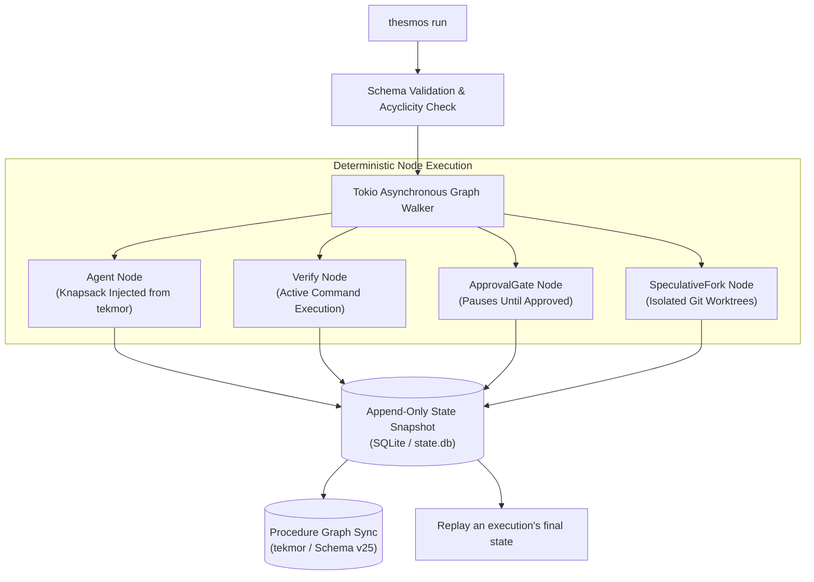

# thesmos

> **Deterministic Workflow DAG Engine & Cognitive State Machine for Coding Agents.**

[](CHANGELOG.md)
[](LICENSE)
[-lightgrey.svg)](https://autonomic-ai.dev)
[](https://autonomic-ai.dev)

Part of [Autonomic AI](https://autonomic-ai.dev), alongside [tekmor](https://github.com/autonomic-ai-dev/tekmor). Replaces probabilistic agent prompt loops with **declarative, version-controlled Directed Acyclic Graphs (DAGs)**, immutable snapshots, and human-in-the-loop gates.

---

## Architectural Overview


```mermaid
flowchart TD
    Trigger["thesmos run <workflow.yaml>"] --> Validate["Schema Validation & Acyclicity Check"]
    Validate --> Walker["Tokio Asynchronous Graph Walker"]
    
    subgraph ExecutionEngine ["Deterministic Node Execution"]
        Walker --> AgentNode["Agent Node<br/>(Knapsack Injected from tekmor)"]
        Walker --> VerifyNode["Verify Node<br/>(Active Command Execution)"]
        Walker --> GateNode["ApprovalGate Node<br/>(Pauses Until Approved)"]
        Walker --> SpecNode["SpeculativeFork Node<br/>(Isolated Git Worktrees)"]
    end

    AgentNode --> Snapshot[("Append-Only State Snapshot<br/>(SQLite / state.db)")]
    VerifyNode --> Snapshot
    GateNode --> Snapshot
    SpecNode --> Snapshot

    Snapshot --> BrainSync[("Procedure Graph Sync<br/>(tekmor / Schema v25)")]
    Snapshot --> Replay["Replay an execution's final state"]
```

---

## Why thesmos?

| Challenge in Agentic Automation | thesmos Solution | Mechanism |
| :--- | :--- | :--- |
| **Unbounded Agent Retries & Token Burns** | Strict DAG execution bounds worker tasks to isolated steps with retry policies | Exponential backoff and circuit breakers |
| **Hallucinatory Control Flow** | Declarative YAML topology dictates transitions and branching conditions | Acyclic graph validator with boolean condition expressions |
| **Silent Failures & Missing Evidence** | `Verify` nodes actively execute shell validation commands under timeouts | Captures exit codes and stdout/stderr |
| **Context Window Pollution** | Each node is injected with a surgical cognitive knapsack from `tekmor` | Node-specific `_brain_knapsack` with token budgeting |
| **Disaster Recovery Amnesia** | Immutable state snapshots recorded at every step transition | `thesmos replay <EXECUTION_ID>` recreates a run's final state |
| **Flaky or Speculative Refactors** | Parallel speculative worktree branching | Evaluates multiple git branches concurrently, merging winning verified path |

---

## Node Kinds (`NodeKind`)

| Kind | Purpose | Behavior |
| :--- | :--- | :--- |
| **`Agent`** | Discrete cognitive task | Hydrates a knapsack of up to 500 tokens via `tekmor route_task`, delegates to worker, snapshots result |
| **`Verify`** | Machine validation | Actively executes `command`, captures exit code and output, sets `verified` status |
| **`ApprovalGate`** | Human-in-the-loop barrier | Pauses the workflow until the node payload has `approved: true`. Gates auto-approve by default. |
| **`SpeculativeFork`** | Competitive multi-branching | Spawns isolated Git worktrees to evaluate multiple solutions concurrently |
| **`Fork` / `Join`** | Concurrency barrier | Fans out across parallel branches, joining when all prerequisites resolve |
| **`Debate`** | Multi-agent refinement | Alternates between coder and critic agents in iterative rounds |
| **`Vote`** | Consensus selection | Runs prompt N times with temperature variance, selecting best output |
| **`Router`** | Dynamic branch decision | Injects variables into payload to evaluate conditional edges |
| **`Hydrate`** | Context gathering | Collects environment diagnostics (diffs, logs) before agent execution |
| **`Checkpoint`** | Audit synchronization | Appends immutable point-in-time state snapshot |

---

## Quickstart & Installation

### Option 1: Homebrew (macOS — Recommended)

```bash
brew tap autonomic-ai-dev/tap
brew install thesmos
thesmos init
```

### Option 2: Direct Download / Curl

```bash
curl -fsSL https://raw.githubusercontent.com/autonomic-ai-dev/thesmos/master/scripts/install.sh | bash -s -- --global
```

### Option 3: Compile From Source (Rust)

```bash
git clone https://github.com/autonomic-ai-dev/thesmos.git
cd thesmos
cargo build --release -p thesmos
./target/release/thesmos doctor
```

---

## Core Commands

| Command | Purpose |
| :--- | :--- |
| `thesmos init` | Scaffolds an example workflow and checks the environment |
| `thesmos validate <file>` | Validates DAG syntax, node types, and acyclicity |
| `thesmos run <file>` | Executes a workflow DAG synchronously |
| `thesmos run <file> --brain` | Enables tekmor routing and enrichment |
| `thesmos inspect <EXECUTION_ID>` | Shows the history of one execution |
| `thesmos replay <EXECUTION_ID>` | Recreates an execution's final state |
| `thesmos status` | Lists the capabilities planned for this scaffold |
| `thesmos serve` | Starts the live dashboard API on `:3000` and the dashboard on `:3001` |
| `thesmos mcp-serve` | Starts stdio MCP server for Cursor, Claude, AGY |
| `thesmos doctor` | Checks rustc, protoc, bun, the `tekmor` binary, the spine state directory and the example workflow |

---

## Declarative Workflow Example

```yaml
name: bugfix_pipeline
version: 1
description: "Reproduce, isolate, fix, and verify a bug with human sign-off"
start_node: reproduce_failure

nodes:
  - name: reproduce_failure
    kind: verify
    command: "cargo test --test reproduce_bug"

  - name: isolate_and_patch
    kind: agent
    description: "Analyze test failure, isolate root cause, and apply minimal patch"
    retry_policy:
      max_attempts: 2
      backoff_ms: 1000

  - name: verify_fix
    kind: verify
    command: "cargo test --all-features"

  - name: sign_off
    kind: approval_gate
    description: "Operator sign-off before committing changes"

edges:
  - from: reproduce_failure
    to: isolate_and_patch
  - from: isolate_and_patch
    to: verify_fix
  - from: verify_fix
    to: sign_off
```

Check it with `thesmos validate bugfix.yaml`. Built-in workflows are available through `thesmos init --with list`.

---

## Verification & Development

```bash
# Formatter & linter check
cargo fmt --all -- --check
cargo clippy -p thesmos -- -D warnings

# Run all test suites
cargo test -p thesmos

# Run workflow engine verification playbook
.verify/playbooks/verify_workflow_engine.sh
```

---

## Ecosystem & Documentation

- **Documentation Portal**: [https://autonomic-ai.dev](https://autonomic-ai.dev)
- **Workflow & DAG Architecture**: [https://autonomic-ai.dev/docs/workflows](https://autonomic-ai.dev/docs/workflows)
- **Ecosystem Architecture Guide**: [https://autonomic-ai.dev/docs/architecture](https://autonomic-ai.dev/docs/architecture)
- **Cognitive Governor (`tekmor`)**: [https://github.com/autonomic-ai-dev/tekmor](https://github.com/autonomic-ai-dev/tekmor)

---

## License

Apache-2.0 © [Autonomic AI](https://github.com/autonomic-ai-dev) · See [CHANGELOG.md](CHANGELOG.md) for release history.
